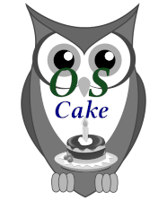

<h1 align="center">
    OSCake : Open Source Compliance artifact knowledge engine
</h1>

    
    
    

  <a href="#development">Development</a> •
  <a href="#documentation">Documentation</a> •
  <a href="#support-and-feedback">Support</a> •
  <a href="#how-to-contribute">Contribute</a> •
  <a href="#contributors">Contributors</a> •
  <a href="#licensing">Licensing</a>

The goal of the OSCake project is to develop an XTEXT / XTEND based intelligent Open Source Compliance artifact knowledge engine, that

* takes a description of a package collection and the compliance artifacts found in the packages

* creates the one **O**pen **S**ource **C**ompliance **F**ile that - if distributed together with package collection - assures that the package collection is distributed compliantly = in accordance with the requirements of the involved licenses.

The point of this project is, that the knowledge which Open Source compliance artifacts have to be created / delivered in the context of which licenses and which architectural constraints is inherently embedded into the Domain Specific Language(s) defined and evaluated by XText and XTend.

## About this component

If you read the [reasons to set up the TDOSCA initiative](https://github.com/Open-Source-Compliance/tdosca) and especially the transcription of our lecture given on the [Open Compliance Summit 2020](https://github.com/Open-Source-Compliance/tdosca/blob/master/doc/20201201-lecture-at-open-compliance-summit/README.md), then you end up in sheet signaling in which sense (for example) ORT and OSCake will cooperate: OSCake takes results gathered by ORT and compiles the really license adequate Open Source Compliance File:

OSCake applies the Open Source License Compliance knowledge - inherently in a declarative manner represented into the domain specific language - and creates the inherently license adequate Open Source Declaration File from which it derives the distributable markdown version.

Existing Open Source scan tools create large lists of compliance entities that in any sense could be relevant for creating Open Source Compliance Artifact(s). OSCake knows which of them must used in which license context and creates the one Open Source Compliance File which really meets the requirements of the involved licenses.

## Development

_TBD_

### Build

_TBD_

## Code of Conduct

This project has adopted the [Contributor Covenant](https://www.contributor-covenant.org/) in version 2.0 as our code of conduct. Please see the details in our [CODE_OF_CONDUCT.md](CODE_OF_CONDUCT.md). All contributors must abide by the code of conduct.

## Working Language

We decided to apply _English_ as the primary project language.  

Consequently, all content will be made available primarily in English. We also ask all interested people to use English as language to create issues, in their code (comments, documentation etc.) and when you send requests to us. The application itself and all end-user facing content will be made available in other languages as needed.

## Documentation

_TBD_

## Support and Feedback
The following channels are available for discussions, feedback, and support requests:

| Type                     | Channel                                                |
| ------------------------ | ------------------------------------------------------ |
| **Issues**   |  </a>   |
| **Other Requests**    |    |

## How to Contribute

Contribution and feedback is encouraged and always welcome. For more information about how to contribute, the project structure, as well as additional contribution information, see our [Contribution Guidelines](./CONTRIBUTING.md). By participating in this project, you agree to abide by its [Code of Conduct](./CODE_OF_CONDUCT.md) at all times.

## Contributors

Our commitment to open source means that we are enabling -in fact encouraging- all interested parties to contribute and become part of its developer community.

## Licensing

Copyright (c) 2020 Deutsche Telekom AG.

Licensed under the **Eclipse Public License 2.0** (the "License"); you may not use this file except in compliance with the License. You may obtain a copy of the License by reviewing the file [LICENSE](./LICENSE) in the repository.

Unless required by applicable law or agreed to in writing, software distributed under the License is distributed on an "AS IS" BASIS, WITHOUT WARRANTIES OR CONDITIONS OF ANY KIND, either express or implied. See the [LICENSE](./LICENSE) for the specific language governing permissions and limitations under the License.
