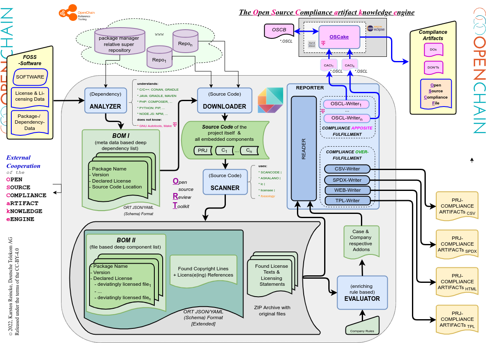
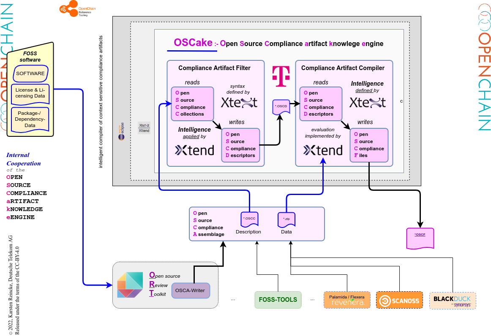

# Towards a Fully Automated FOSS Compliance Tool Chain

This post summarizes the lecture ""*Towards a Fully Automated FOSS Compliance Tool Chain*" held Karsten Reincke and Daniel Eder at the "Standardization Offsite" 2022: We will describe and demo the challenge and offer an already usable solution (which is not the last word of wisdom!) before we sketch a *perfect* solution.

## (1) Challenge

Products based on **F**ree and **O**pen **S**ource **S**oftware normally use complex software stacks with many different FOSS (sub) components.
Regardless of the size of this software stack, the one who wants to distribute his product compliantly, has to bundle the respective compliant artifacts with the product. To be able to do so, he must
* know which open source software components are (recursively) embedded into his product,
* know under which FOSS license the components and its (sub)parts are licensed
* know what the respective licenses require to bundle with the product
* create the respective *compliance artifacts*
* bundle them with his product.

We will demo the complexity of this constraint on the base of the [FOSS Compliance TestCase No 11](https://github.com/Open-Source-Compliance/tdosca-tc11) released by Deutsche Telekom

## (2) Semi Automated solution

The FOSS community offers already a set of supporting tools: [http://oss-compliance-tooling.org/Tooling-Landscape/OSS-Based-License-Compliance-Tools/](http://oss-compliance-tooling.org/Tooling-Landscape/OSS-Based-License-Compliance-Tools/). These tools focus on scanning FOSS software for gathering information, necessary to solve the challenge. Or they solve important subtasks. But none of them tries to create the required compliance artifacts automatically on the base of the gathered information. It is clear why: In order to be able to do that, they would have to have implemented the legal knowledge in the form of an expert system.

We will demo the tool ``sag.oscf`` =  *Semi Automated Generation of Open Source Compliance Files*  [https://github.com/Open-Source-Compliance/sag.oscf](https://github.com/Open-Source-Compliance/sag.oscf) - released by Deutsche Telekom to close this gap (at least partially).

The advantage of this tool is, that one
* can use it already
* need no longer the respective legal advice.

The disadvantage of this tool is, that
* one still must gather the information more or less manually
* the expert system is only able to deal with some FOSS licenses

## (3) Towards A Fully Automated FOSS Compliance Tool Chain: ORT

Despite their limitations, the existing FOSS compliance tools offer one great benefit: doing the same work manually, would establish a big cost trap. In our times, the work of the compliance tools must become repeatable because they have to be integrated in a CI/CD chain.

We describe ORT, the [Open Source Review Toolkit](https://github.com/oss-review-toolkit/ort) and the changes that DT has suggested and implemented to help close the gab.

To get a summary take a look at this image:

## (4) Towards A Fully Automated FOSS Compliance Tool Chain: OSCake

Nevertheless, ORT itself is not an expert system, offering and applying the legal knowledge to a specific case. Thus, ORT alone is not able to close the gap. But if we had a system which takes and evaluates the results gathered by ORT and which - as an expert system like *sag.oscf* - applied its embedded legal knoweldge, we would have closed the described gap.

We will discuss the state of OSCake, the [Open Source Compliance artifact knowledge engine](https://github.com/Open-Source-Compliance/OSCake) developed on behalf of and under the leadship of Deutsche Telekom.

To get a summary take a look at this image:

