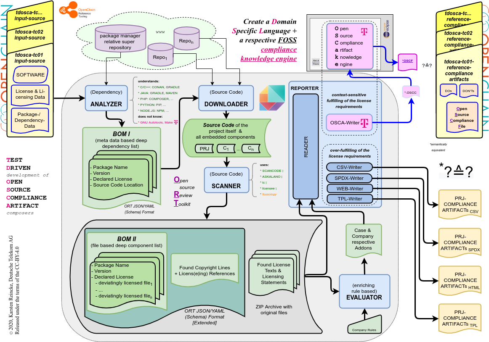

<!-- LTeX:Language=en-US -->
<h1 align="center">
    OSCake : An Open Source Compliance artifact knowledge engine
</h1>

    
    
    

  <a href="#development">Development</a> •
  <a href="#documentation">Documentation</a> •
  <a href="#support-and-feedback">Support</a> •
  <a href="#how-to-contribute">Contribute</a> •
  <a href="#contributors">Contributors</a> •
  <a href="#licensing">Licensing</a>

The goal of the OSCake project is to develop an XTEXT / XTEND based intelligent Open Source Compliance artifact knowledge engine, that

* takes a description of a package collection and the compliance artifacts found in the packages

* creates the one **O**pen **S**ource **C**ompliance **F**ile that - if distributed together with package collection - assures that the package collection is distributed compliantly = in accordance with the requirements of the involved licenses.

**The point of OSCake is, that the (legal, licenses specific and architectural) knowledge which Open Source compliance artifacts have to be created and bundled with a product to distribute it compliantly is inherently embedded into a set of two Domain Specific Languages defined and evaluated by XText and XTend.**

## About this component

If you read the [reasons to set up the TDOSCA initiative](https://github.com/Open-Source-Compliance/tdosca) and especially the transcription of our lecture given on the [Open Compliance Summit 2020](https://github.com/Open-Source-Compliance/tdosca/blob/master/doc/20201201-lecture-at-open-compliance-summit/README.md), then you end up in a sheet signaling in which sense (for example) ORT and OSCake will cooperate:

**OSCake takes results gathered by ORT and automatically compiles a license adequate Open Source Compliance File which can be bundled with the respective product to distribute it compliantly:**

To do so, firstly *OSCake* has defined a weak compliance artifact language *OSCC*. By this domain specific language it defines, which data have generally to be gathered. It follows the principle 'One (method to gather data) fits all (licenses)'.

Secondly, *OSCake* has defined the strict compliance artifact language *OSCF*. By this domain specific language it defines, which data have to be put together with respect to each component to distribute all these components compliantly.

As interpretation of the *OSCC* file, *OSCake* creates the respective *OSCF*-File: using the gathered data described in the *OSCC* file, it creates the license specific *Open Source Compliance File*

As interpretation of the *OSCF* file, *OSCake* creates the respective *OSCF.md*-File: by evaluating the *OSCF* file and some external data, it creates the one *Open Source Compliance (Markdown) File*, which can indeed be bundled with the respective product to distribute it compliantly.

The advantage of using a domain specific language in this context is, that one can represent the Open Source License Compliance knowledge in a declarative manner:

So, existing Open Source scan tools create large lists of compliance entities that in any sense could be relevant for creating Open Source Compliance Artifact(s). But *OSCake* takes these more or less complete and mostly over-fulfillinf sets. The *Open Source Compliance artifact knowledge engine* knows which of the articats found by the Open Source scanning tools must used in which license context and derives the one Open Source Compliance File which really meets the requirements of the involved licenses.

## Getting the OSCX language definitions run:

### Preparing the environment

1. Install the *Eclipse IDE for Java and DSL Developers* from [https://www.eclipse.org/downloads/packages/](https://www.eclipse.org/downloads/packages/). (Alternatively install the Xtext and Xtend via the Eclipse Marketplace)
2. Install a markdown viewer being able to deal with GitHub flavored markdown - either as *Eclipse Plugin* or as an *external Editor*
3. Create a new *Eclipse Working Directory* `$HOME/ews.dsl`.
4. Inside of this directory create the *Eclipse Working Directories* `ews.xtx.` and `ews.osc`
5. Start Eclipse and select `ews.dsl/ews.xtx` as working directory.
6. Create two new XText projects (New/Project/Xtext/Xtext-Project) with the parameters:
  - Project a:
    - Project name: `de.oscake.strict`
    - Language name: `de.oscake.strict.Oscf`
    - Extensions: `oscf`
  - Project b:
    - Project name: `de.oscake.weak`
    - Language name: `de.oscake.weak.Oscc`
    - Extensions: `oscc`
7. After having done so, the Eclipse Language editor should have automatically opened the newly create language definition files (if not, open them manually: *src/de.oscake.strict/Oscf.Xtext* and *src/de.oscake.weak/Oscc.Xtext*) In each of these opened windows, select the context menu in the language editor and call `run as/Generate XText Artifacts`. 
9.  Stop Eclipse and copy the following files from the OSCake repository to the eclipse working directory using the normal file system:
  - `cp src/Oscc.xtext $HOME/ews.dsl/ews.xtx/de.oscake.weak/src/de/oscake/weak/`
  - `cp src/OsccGenerator.xtend $HOME/ews.dsl/ews.xtx/de.oscake.weak/src/de/oscake/weak/generator/`
  - `cp src/Oscf.xtext $HOME/ews.dsl/ews.xtx/de.oscake.strict/src/de/oscake/strict/`
  - `cp src/OscfGenerator.xtend $HOME/ews.dsl/ews.xtx/de.oscake.strict/src/de/oscake/strict/generator/`
9. Create a directory `$HOME/data.dsl`
10. Open the file `$HOME/ews.dsl/ews.xtx/de.oscake.strict/src/de/oscake/strict/generator/OscfGenerator.xtend` and set the value `absRepoPath` to the absolute(!) path of the created *data.dsl-directory*
11. Restart Eclipse and recall `run as/Generate XText Artifacts` from the context menu of the replaced files *src/de.oscake.strict/Oscf.Xtext* and *src/de.oscake.weak/Oscc.Xtext*
12. Touch the `de.oscake.strict` project with your alternative mouse key, select `properties`, open `Run/Debug Settings,` and do this
  - Duplicate the item 'Launch Runtime Eclipse'
  - Edit the created item
  - set its name to ews.osc
  - set the value of *Location* to `${workspace_loc}/../ews.osc`
13. Call `run as/Eclipse Application` from the context menu of *de.oscake.strict* and select the created *osc*-configuration in the dialog *select a launch configuration to run*
14. Create a new Java project named 'tc' (testcase)
15. Inside of this project, create a directory `src-gen` as sibling of the directory `src`
16. Create a new file *src/what-ever-you-want.***oscf**.
17. Play around with inserting your first *Open Source Compliance Declaration*. (Keep in mind: `String Space` allows you to select the next syntactically valid input). At the end, delete the created 'play-around'-files

### Installing the test case TC05

18. On the file level
  - copy `examples/tc05/tc05.oscc` from the OSCake repository to `$HOME/ews.dsl/ews.osc/tc/src/`
  - inside of  `$HOME/data.dsl` create a directory with the name of the zip-file without the extension = `tc05`
  - inside of `$HOME/data.dsl/tc05` unzip the  zip file `examples/tc05/tc05.zip`
  - copy the directories `examples/multiply.usable.licenses` and examples `company.specific.snippets` (including their content) to `$HOME/data.dsl`
19. Inside of Eclipse press key F5
20. Exec the following steps to test a complete round trip from oscc via oscf to oscf.md:
  - open `tc05.oscf`
  - insert a blank outside of the code and save the file (that triggers the automatical generation of tc05.oscf)
  - cp `src-gen/tc05.oscf` `src/tc05.oscf`
  - open `tc05.oscf`
  - insert a blank outside of the code and save the file (that triggers the automatical generation of tc05.oscf.md)
  - open `tc05.oscf.md`

### About the other use cases

The directory `examples` in the *OSCake-Repository* also contains other test cases. Each of them consists of
- the *OSCC* file, created by ORT on the base of the data it has gathered
- a zip-File - also created by ORT - which contains some additional data - also gathered by ORT - which are necessary to create the respective *OSCF* file.

These cases can be used / evaluated in the same manner as tc05 has been activated in *OSCake*

### About some traps

* While creating the Xtext Artifacts via the respective file context menu in step 11, you can run into an error: The semantic of both languages (Xtend implementation) depends on each other, but does not cooperate with the artifacts created in step 7. The solution is:
  - delete the error messages on the eclipse level
  - let the artifacts be created again.

## The language definition of OSCF

* Work on `src/de.oscake.strict/Oscf.Xtext` for improving the strict Open Source Compliance Definition language.
* Work on `src/de.oscake.strict.generator/OscfGenerator.xtend` for improving the evaluation of oscf-files.
* Work on `src/de.oscake.weak/Oscc.Xtext` for improving the weak Open Source Compliance Collection language.
* Work on `src/de.oscake.weak.generator/OsccGenerator.xtend` for improving the evaluation of oscf-files.

Keep in mind:

* The definition of a valid OSCF file (written in the XText file Oscf.Xtext) declaratively defines the compliance knowledge.
* The corresponding Open Source Compliance File (im Markdown format) is derived from the OSCF file by the OscfGenerator.xtend.
* The definition of a valid OSCC file (written in the XText file Oscc.Xtext) defines the elements a scanner can collect / handover to OSCake.
* The OsccGenerator.xtend applies the knowledge defined in OSCF: he derives OSCF file from the OSCC file (by throwing away what's unnecessary etc.) and to mark what's still missed to create a valid OSCF = a appropriate OSCF.

## Code of Conduct

This project has adopted the [Contributor Covenant](https://www.contributor-covenant.org/) in version 2.0 as our code of conduct. Please see the details in our [CODE_OF_CONDUCT.md](CODE_OF_CONDUCT.md). All contributors must abide by the code of conduct.

## Working Language

We decided to apply _English_ as the primary project language.  

Consequently, all content will be made available primarily in English. We also ask all interested people to use English as language to create issues, in their code (comments, documentation etc.) and when you send requests to us. The application itself and all end-user facing content will be made available in other languages as needed.

## Support and Feedback
The following channels are available for discussions, feedback, and support requests:

| Type                     | Channel                                                |
| ------------------------ | ------------------------------------------------------ |
| **Issues**   |  </a>   |
| **Other Requests**    |    |

## How to Contribute

Contribution and feedback is encouraged and always welcome. For more information about how to contribute, the project structure, as well as additional contribution information, see our [Contribution Guidelines](./CONTRIBUTING.md). By participating in this project, you agree to abide by its [Code of Conduct](./CODE_OF_CONDUCT.md) at all times.

## Contributors

Our commitment to open source means that we are enabling -in fact encouraging- all interested parties to contribute and become part of its developer community.

## Licensing

Copyright (c) 2020 Deutsche Telekom AG.

Licensed under the **Eclipse Public License 2.0** (the "License"); you may not use this file except in compliance with the License. You may obtain a copy of the License by reviewing the file [LICENSE](./LICENSE) in the repository.

Unless required by applicable law or agreed to in writing, software distributed under the License is distributed on an "AS IS" BASIS, WITHOUT WARRANTIES OR CONDITIONS OF ANY KIND, either express or implied. See the [LICENSE](./LICENSE) for the specific language governing permissions and limitations under the License.
